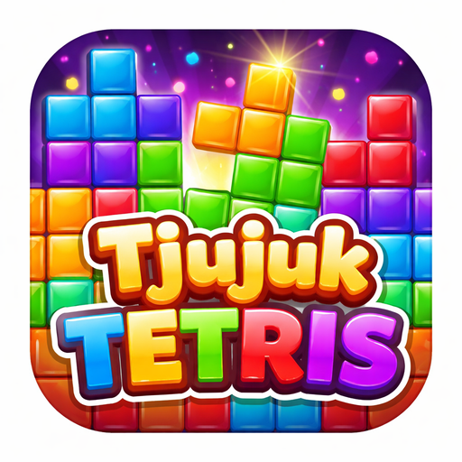

# Tjujuk Tetris

English | [Bahasa Indonesia Privacy Policy](https://watchestrader4-cell.github.io/tjujuktetris/)

## Description

Tjujuk Tetris is an Android block puzzle game built with Jetpack Compose.

- Single-player offline gameplay
- Calm red interface theme
- Sound controls and pause/resume support
- Release-ready Android App Bundle and signed release build

## Gameplay Rules

- Clear 1 line: 100 points
- Clear 2 lines: 300 points
- Clear 3 lines: 700 points
- Clear 4 lines: 1500 points
- Falling speed increases as cleared lines increase

## Architecture

## Screenshots

## Privacy Policy

https://watchestrader4-cell.github.io/tjujuktetris/

## License

See [LICENSE](LICENSE).
